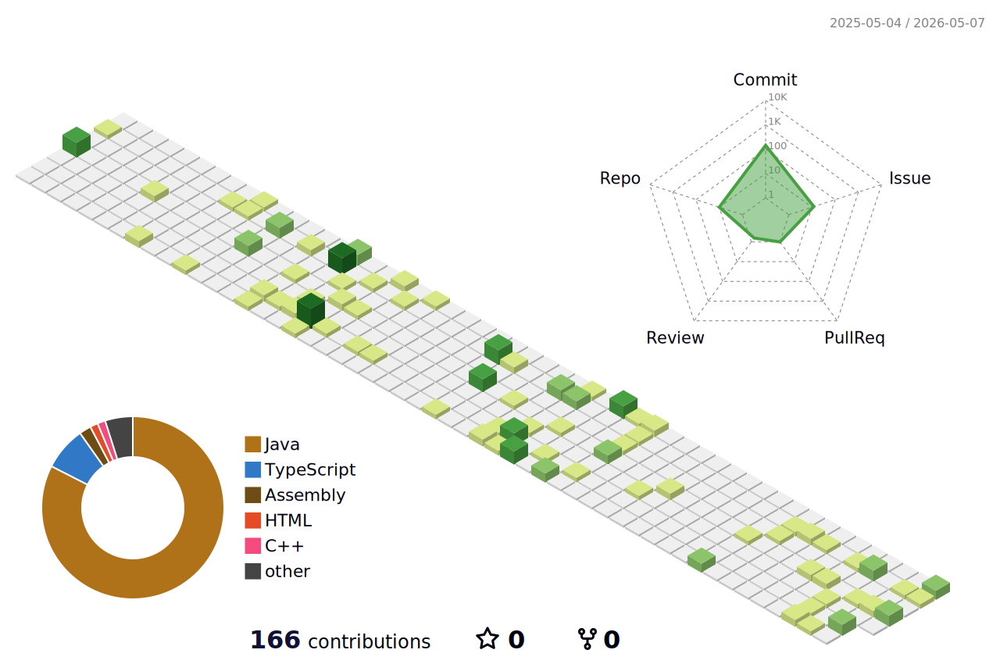

### Olá, meu nome é Gabriel! 👋
Seja bem-vindo ao meu perfil. Sou um desenvolvedor de software focado na construção de sistemas robustos, sempre buscando utilizar as melhores práticas da engenharia de software. Atualmente, tenho me dedicado ao estudo do Java e do framework Spring Boot.

---

#### 🛠️ **Tecnologias e Ferramentas**

##### Linguagens

##### Frameworks e Ferramentas

##### Banco de dados

---

#### 📈 **Atividade**

---

#### 📬 **Vamos nos conectar?**

  

  

  

<!--
**Gabrielx47/Gabrielx47** is a ✨ _special_ ✨ repository because its `README.md` (this file) appears on your GitHub profile.

Here are some ideas to get you started:

- 🔭 I’m currently working on ...
- 🌱 I’m currently learning ...
- 👯 I’m looking to collaborate on ...
- 🤔 I’m looking for help with ...
- 💬 Ask me about ...
- 📫 How to reach me: ...
- 😄 Pronouns: ...
- ⚡ Fun fact: ...
-->
